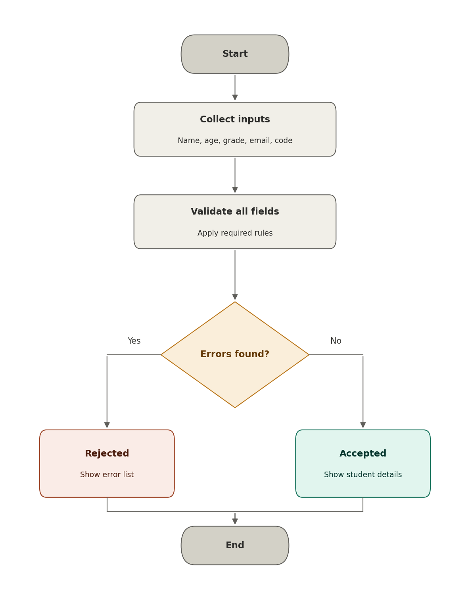

# Input Validation and Output Verification
**Activity:** PSHS Workshop Registration Validator
**Name:** Zeff Lucas B. Gutierrez
**Section:** 8-Dahlia
**Quarter:** 1

---

## Activity Overview
In this activity, I created a program that validates information entered into a PSHS workshop registration system.
The program checks whether user input satisfies specific requirements before accepting the registration.
The program validates:
- student name
- age
- grade level
- email address and
- registration code.

---

# Part A - Validation Requirements
Complete the table below before writing your program.

| Data Captured | Expected Input | Validation Type | Invalid Input Example | Validation Rule | Error Message |
|---|---|---|---|---|---|
| Student Name | Non-empty text | Presence | `""` (blank) | Name must not be empty after removing surrounding spaces | Student name is required. |
| Age | Whole number from 11 to 18 | Data type + Range | `fourteen` / `10` / `19` | Must convert to an integer, and must be between 11 and 18 inclusive | Age must be a number. / Age must be from 11 to 18. |
| Grade Level | One of 7, 8, 9, 10, 11, 12 | Acceptable value | `13` | Must exactly match one of the allowed grade strings | Invalid grade level. Must be 7-12. |
| Email Address | Address ending in `@brc.pshs.edu.ph` | Pattern | `studentpshs.edu.ph` | Must end with `@brc.pshs.edu.ph` and have at least one character before it | Invalid email. Must be a valid @brc.pshs.edu.ph address. |
| Registration Code | Exactly 6 letters/numbers | Length + Data type | `ABC` | Must be exactly 6 characters long and contain only letters and digits | The registration code must contain exactly 6 alphanumeric characters. |

---

## Validation Questions

### 1. Why should the student name not be blank?
> A blank name means there is no way to identify whose registration is being processed. Presence validation stops an empty record from ever being accepted.

### 2. Why should age be checked for both data type and range?
> The program needs to convert the age into a number before it can compare it to anything, so a data type check comes first. Once it is a number, it also needs to fall inside the workshop's allowed age group (11-18), which is a separate, logical check on the value itself.

### 3. Why should grade level only accept specific values?
> Only grades 7 through 12 are eligible for the workshop, so the program should not accept a grade like `13` or `0` that does not correspond to a real, eligible grade level.

### 4. What format requirements did you use for the email address?
> The email must end exactly with `@brc.pshs.edu.ph`, and there must be at least one character before that domain (so the domain alone, with nothing in front of it, is rejected).

### 5. What length requirement did you use for the registration code?
> The registration code must be exactly 6 characters long, and every character must be a letter or a digit (no symbols or spaces).

---

# Part B - Program Design
Before writing your program, create either a **flowchart or pseudocode** showing its logic.

## Flowchart


## Pseudocode

```text
START

DISPLAY "Enter student name: "
INPUT student_name (remove leading/trailing spaces)

DISPLAY "Enter age: "
INPUT age_input (remove leading/trailing spaces)

DISPLAY "Enter grade level: "
INPUT grade_level (remove leading/trailing spaces)

DISPLAY "Enter email: "
INPUT email (remove leading/trailing spaces)

DISPLAY "Enter registration code: "
INPUT registration_code (remove leading/trailing spaces)

SET errors = empty list

IF student_name is empty THEN
    ADD "Student name is required." TO errors
END IF

SET age = NULL
IF age_input CAN be converted to a number THEN
    SET age = number value of age_input
    IF age < 11 OR age > 18 THEN
        ADD "Age must be from 11 to 18." TO errors
    END IF
ELSE
    ADD "Age must be a number." TO errors
END IF

IF grade_level NOT IN ["7","8","9","10","11","12"] THEN
    ADD "Invalid grade level. Must be 7-12." TO errors
END IF

SET domain = "@brc.pshs.edu.ph"
IF email does NOT end with domain THEN
    ADD "Invalid email. Must be a valid @brc.pshs.edu.ph address." TO errors
ELSE
    SET username = email with domain removed from the end
    IF username is empty THEN
        ADD "Invalid email. Must be a valid @brc.pshs.edu.ph address." TO errors
    END IF
END IF

IF length of registration_code != 6 OR registration_code is NOT alphanumeric THEN
    ADD "The registration code must contain exactly 6 alphanumeric characters." TO errors
END IF

DISPLAY "------------------------------"

IF errors is empty THEN
    DISPLAY "REGISTRATION ACCEPTED"
    DISPLAY "------------------------------"
    DISPLAY "Student:", student_name
    DISPLAY "Age:", age
    DISPLAY "Grade Level:", grade_level
    DISPLAY "Email:", email
ELSE
    DISPLAY "REGISTRATION REJECTED"
    DISPLAY "------------------------------"
    FOR EACH error IN errors
        DISPLAY "-", error
    END FOR
END IF

END
```

Your design should show:
- user input
- validation decisions
- error messages
- accepted registration
- rejected registration.

---

# Part C - Program Implementation

## Programming Language
> Python

## Source Code File
[`workshop_validator.py`](workshop_validator.py)

## Final Code
```python
VALID_GRADES = ["7", "8", "9", "10", "11", "12"]
EMAIL_DOMAIN = "@brc.pshs.edu.ph"

student_name = input("Enter student name: ").strip()
age_input = input("Enter age: ").strip()
grade_level = input("Enter grade level: ").strip()
email = input("Enter email: ").strip()
registration_code = input("Enter registration code: ").strip()

errors = []

if student_name == "":
    errors.append("Student name is required.")

age = None
try:
    age = int(age_input)
    if age < 11 or age > 18:
        errors.append("Age must be from 11 to 18.")
except ValueError:
    errors.append("Age must be a number.")

if grade_level not in VALID_GRADES:
    errors.append("Invalid grade level. Must be 7-12.")

username = email[:-len(EMAIL_DOMAIN)] if email.endswith(EMAIL_DOMAIN) else ""

if not email.endswith(EMAIL_DOMAIN) or username == "":
    errors.append("Invalid email. Must be a valid @brc.pshs.edu.ph address.")

if len(registration_code) != 6 or not registration_code.isalnum():
    errors.append("The registration code must contain exactly 6 alphanumeric characters.")

print("------------------------------")

if not errors:
    print("REGISTRATION ACCEPTED")
    print("------------------------------")
    print("Student:", student_name)
    print("Age:", age)
    print("Grade Level:", grade_level)
    print("Email:", email)
else:
    print("REGISTRATION REJECTED")
    print("------------------------------")
    for e in errors:
        print("-", e)
```

---

## Validation Techniques Used

### Presence Validation
Explain where you used presence validation.
> Used on the student name field. After stripping spaces, the program checks whether `student_name` is an empty string and adds an error if so.

### Data Type Validation
Explain where you used data type validation.
> Used on the age field. The program attempts to convert `age_input` into an integer with `int()` inside a `try/except` block. If the conversion raises a `ValueError`, the input was not a valid number.

### Range Validation
Explain where you used range validation.
> Used on the age field, after the data type check succeeds. The converted `age` value must fall between 11 and 18 inclusive, or an error is added.

### Acceptable Value Validation
Explain where you used acceptable value validation.
> Used on the grade level field. `grade_level` must exactly match one of the strings in the `VALID_GRADES` list ("7" through "12").

### Pattern Validation
Explain the simple pattern rule you used.
> Used on the email field. Instead of a full regex, the program checks that `email` ends with the exact domain `"@brc.pshs.edu.ph"` using `str.endswith()`, and that something exists before that domain (so the domain by itself is rejected).

### Length Validation
Explain the length rule you used.
> Used on the registration code field. The program checks that `len(registration_code)` equals exactly 6, combined with `str.isalnum()` to make sure all 6 characters are letters or digits.

---

# Part D - Testing
Test your program using both valid and invalid inputs.

| Test | Input / Condition | Validation Being Tested | Expected Output | Actual Output | Result |
|---:|---|---|---|---|---|
| 1 | All inputs valid (Name: `Juan Dela Cruz`, Age: `15`, Grade: `9`, Email: `juan@brc.pshs.edu.ph`, Code: `ABC123`) | Normal case | REGISTRATION ACCEPTED with all 4 fields echoed back | REGISTRATION ACCEPTED with all 4 fields echoed back | PASS |
| 2 | Blank student name | Presence | REGISTRATION REJECTED - "Student name is required." | REGISTRATION REJECTED - "Student name is required." | PASS |
| 3 | Age = `fourteen` | Data type | REGISTRATION REJECTED - "Age must be a number." | REGISTRATION REJECTED - "Age must be a number." | PASS |
| 4 | Age = `11` | Minimum boundary | REGISTRATION ACCEPTED, Age: 11 | REGISTRATION ACCEPTED, Age: 11 | PASS |
| 5 | Age = `18` | Maximum boundary | REGISTRATION ACCEPTED, Age: 18 | REGISTRATION ACCEPTED, Age: 18 | PASS |
| 6 | Age = `10` | Range | REGISTRATION REJECTED - "Age must be from 11 to 18." | REGISTRATION REJECTED - "Age must be from 11 to 18." | PASS |
| 7 | Grade Level = `13` | Acceptable value | REGISTRATION REJECTED - "Invalid grade level. Must be 7-12." | REGISTRATION REJECTED - "Invalid grade level. Must be 7-12." | PASS |
| 8 | Email = `studentpshs.edu.ph` | Pattern | REGISTRATION REJECTED - "Invalid email. Must be a valid @brc.pshs.edu.ph address." | REGISTRATION REJECTED - "Invalid email. Must be a valid @brc.pshs.edu.ph address." | PASS |
| 9 | Registration Code = `ABC` | Length | REGISTRATION REJECTED - "The registration code must contain exactly 6 alphanumeric characters." | REGISTRATION REJECTED - "The registration code must contain exactly 6 alphanumeric characters." | PASS |
| 10 | Registration Code = `CS2026` | Valid length | REGISTRATION ACCEPTED, Code accepted | REGISTRATION ACCEPTED, all fields echoed back | PASS |

Write **PASS** when the actual output matches the expected output.
Write **FAIL** when it does not.

---

# Part E - Output Verification
Choose any **three tests** from Part D.

## Verification Test 1
**Input:**
```text
Student Name: (blank)
Age: 15
Grade Level: 9
Email: juan@brc.pshs.edu.ph
Registration Code: ABC123
```
**Expected Output:**
```text
------------------------------
REGISTRATION REJECTED
------------------------------
- Student name is required.
```
**Actual Output:**
```text
------------------------------
REGISTRATION REJECTED
------------------------------
- Student name is required.
```
**Result:** PASS
**Explanation:**
> The presence check on `student_name` correctly caught the blank input and produced the single expected error, since every other field was valid.

## Verification Test 2
**Input:**
```text
Student Name: Juan Dela Cruz
Age: 10
Grade Level: 9
Email: juan@brc.pshs.edu.ph
Registration Code: ABC123
```
**Expected Output:**
```text
------------------------------
REGISTRATION REJECTED
------------------------------
- Age must be from 11 to 18.
```
**Actual Output:**
```text
------------------------------
REGISTRATION REJECTED
------------------------------
- Age must be from 11 to 18.
```
**Result:** PASS
**Explanation:**
> Age 10 successfully converts to an integer, so it passes the data type check, but it falls one year below the allowed range, so only the range error is produced.

## Verification Test 3
**Input:**
```text
Student Name: Juan Dela Cruz
Age: 15
Grade Level: 9
Email: juan@brc.pshs.edu.ph
Registration Code: CS2026
```
**Expected Output:**
```text
------------------------------
REGISTRATION ACCEPTED
------------------------------
Student: Juan Dela Cruz
Age: 15
Grade Level: 9
Email: juan@brc.pshs.edu.ph
```
**Actual Output:**
```text
------------------------------
REGISTRATION ACCEPTED
------------------------------
Student: Juan Dela Cruz
Age: 15
Grade Level: 9
Email: juan@brc.pshs.edu.ph
```
**Result:** PASS
**Explanation:**
> All five fields satisfy their respective rules, so `errors` stays empty and the program prints the accepted branch with the data echoed back exactly as entered.

---

# Reflection
Answer briefly.

### 1. Why should a program validate input before processing it?
> Unvalidated input can crash the program (for example, converting text to a number), or let incorrect data (like an underage student or a malformed email) get accepted as if it were correct. Validating first keeps bad data from ever reaching the rest of the program.

### 2. What is the difference between input validation and output verification?
> Input validation happens while the program is running, checking that the data entered follows the rules before it is processed. Output verification happens afterward, where the tester compares what the program actually printed against what it was expected to print, to confirm the program behaves correctly.

### 3. Which validation technique was easiest for you to implement? Why?
> Presence validation was the easiest, since it only required checking whether the stripped name was an empty string.

### 4. Which validation technique was most challenging? Why?
> Pattern validation for the email was the most challenging, since it needed to correctly reject an email that was just the domain with nothing in front of it, not only emails missing the domain entirely.

### 5. How did testing invalid inputs help you improve your program?
> Testing invalid inputs, like a non-numeric age or a domain-only email, showed edge cases the first version of the code did not fully handle, which led to adding the `username` check and the `isalnum()` check for the registration code.

---

# Files for This Activity
- [`workshop_validator.py`](workshop_validator.py)
- `input_validation.md`
- `workshop_validator_flowchart.png` if a flowchart was used

---

[← Back to Main Portfolio](../README.md)
