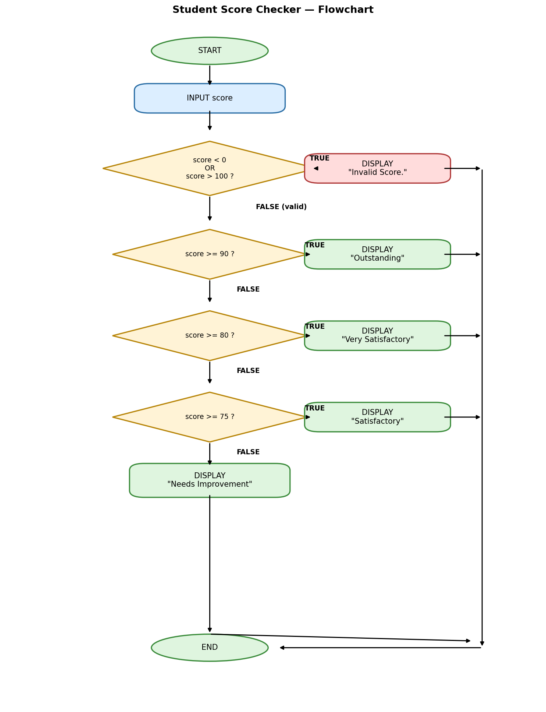

# Clean Decision Code Makeover: Student Score Checker
**Zeff Lucas B. Gutierrez**
**8-Dahlia**
---
## Activity Overview

In this activity, I improved a Student Score Checker program by applying proper coding standards and
selection structures.
The program accepts a student score from 0 to 100 and determines the appropriate classification.

The classifications are:
| Score | Classification |
|---:|---|
| 90–100 | Outstanding |
| 80–89 | Very Satisfactory |
| 75–79 | Satisfactory |
| 0–74 | Needs Improvement |

Scores below 0 or above 100 are considered invalid.

---
# Part 1 - Analyze the Logic

## Input
What information does the program need?
> The program needs one piece of information: the student's score, entered as a whole number.

## Valid Range
**Minimum valid score:**
> 0

**Maximum valid score:**
> 100

## Possible Outputs
List all possible outputs of the program.
1. Invalid Score.
2. Outstanding
3. Very Satisfactory
4. Satisfactory
5. Needs Improvement

## Boundary Condition
What condition will you use to determine whether the score is valid?
> `score < 0 OR score > 100`. If either of these is true, the score is outside the allowed range and is treated as invalid.

## Multiple Decision Paths
Explain how the program decides which classification should be displayed.
> Once the score passes the validity check, the program compares it against a series of cutoffs starting from the highest (90), then 80, then 75. The first condition that is true determines the classification. If none of the higher cutoffs are met, the score falls into "Needs Improvement" by default.

---
# Part 2 - Flowchart
Create a flowchart showing the logic of your program.
Your flowchart should show:
- Start
- Input score
- Valid score check
- Decision paths
- Classification
- Invalid score
- End

## Flowchart

---
# Part 3 - Pseudocode
Create a pseudocode showing the logic of your program.

## Pseudocode  

START
INPUT score
IF score < 0 OR score > 100 THEN
DISPLAY "Invalid Score."
ELSE IF score >= 90 THEN
DISPLAY "Outstanding"
ELSE IF score >= 80 THEN
DISPLAY "Very Satisfactory"
ELSE IF score >= 75 THEN
DISPLAY "Satisfactory"
ELSE
DISPLAY "Needs Improvement"
END

